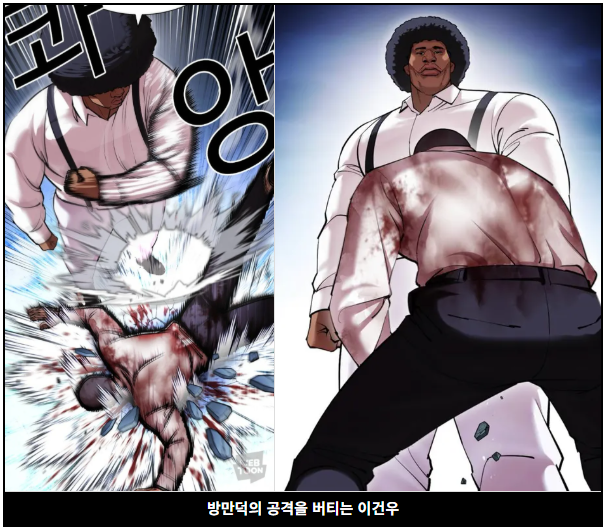

# 이건우
 
영화, 만화, 게임, 스포츠 등 모든 문화 장르를 섭렵한 오타쿠이다. '소사역 이동진'으로도 불린다.  
방만덕의 공격을 버틸 정도로 튼튼하다.

## 1. 어록

 

- 쓰으으으으으으으으읍!
- 어른이 주면 그냥 '감사합니다'하고 받는 거야
- 내가 누군지 알아?
- 내가 관심이 없으면 말도 안 해, 다 관심이 있으까 하는 말이야
- 이게 다 너 잘되라고 하는 소리야
- 나 잘되라고 하는 소리냐? 너 잘되라고 하는 소리야
- 그런 건 난 모르겠고
- 넌 사내 자식이 돼서 꼬추 달려가지고는
- 넌 여자가 돼서 조신하지가 못하게
- 넌 노인이 돼서 현명하지가 못하게
- 넌 애들이 돼서 순수하지가 못하게
- 넌 외계인이 돼서 초음파도 못 쏘냐?
- 윗 사람이 뭘 하고 있으면, 도와드릴 거라도 없냐고 물어봐야 할 거 아니냐?
- 넌 하는 시늉도 안 하냐?
- 내가 하라 그랬냐~ 하지 말라 그랬냐
- 안 되면 되게 해야 할 것 아니냐
- 나 때는 말이야
- 배운다는 정신으로 해야지
- 내가 좋은 게 아니라 다 너한테 남는 거야 
- 이 어린 놈의 새끼가
- 조상님이 말씀하시기를
- 이리로 와서 앉아봐라
- 요즘 것들은 근성이 없어
- 사람이 칼을 뽑았으면 무라도 베어야 할 것 아니냐
- 거 봐라. 내가 그럴 줄 알았다
- 어디서 배운 버르장머리야?
- 네 부모님이 그렇게 가르치시디?
- 가정교육을 어떻게 받았길래
- 가졍교육 참~ 잘 받았다
- 젊어서 고생은 사서도 한다 그랬어
- 세상 참~ 좋아졌어
- 어허
- 너 몇 살이야? 몇 살이야?
- 자네 나랑 해보자는 건가?
- 어른이 말하는데 따박~따박 말대꾸야
- 내가 진짜 성질 많이 죽였다
- 이런 얘기는 돈 내고 들어어야 돼
- 너보다 힘든 사람들이 얼마나 많은데, 감사할 줄 알아야지
- 배우자는 정신이 없어
