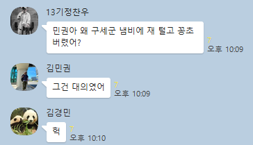

# 김민권
김민권은 대한민국에 거주하고 있는 천룡인이다. 천룡인이기 때문에 수많은 기행을 벌였음에도 그 누구도 감히 비난하지 못한다.  
 
 
'그것이 알고싶다'에서도 소개된 바 있다. 썸네일을 누르면 해당 유튜브 영상 링크로 넘어간다.

## 1. 보유 자산과 권력
기본적으로 세계를 주무르는 천룡인답게, 그 보유 자산이나 권력이 상상을 초월한다.
- 추정 자산 가치는 대략 47경.
- 미군을 통솔하여 버스터콜을 부를 수 있다.
- 주로 이용하는 자택의 마당은 320만 평 정도로, 이를 골프장으로 환산하면 12개, 축구장으로 환산하면 48,000개가 된다.
- 요플레 뚜껑을 핥아먹지 않는다.
- 편의점에서 행사상품은 구입하지 않는다.
- 각 국의 정상들이 취임을 할 때면, 김민권에게 카톡으로 인사를 올리는 암묵적인 의식이 있다.

## 2. 능력과 흑막 설
그동안 루피의 마지막 적으로 예상되었던 [임](https://namu.wiki/w/%EC%9E%84(%EC%9B%90%ED%94%BC%EC%8A%A4)), [오로성](https://namu.wiki/w/%EC%98%A4%EB%A1%9C%EC%84%B1), [검은수염](ih.md), [아카이누](ys.md) 등을 제치고 단연 최종 흑막으로 떠오른 인물이다. 

## 3. 성향

 
특별할 것 없는 전형적인 악당이다.

## 4. 논란 / 사건사고
> 본 항목에서는 실제로 일어난 일에 대해서만 다룹니다. 아직 토론 중인 내용은 다루지 않습니다. 

### 4-1. 2023년
- 버스정류장에 유모차가 있음에도 불구하고 연초를 폈다. 참고로 김민권은 평소에 연초를 피지 않고 전자담배를 핀다.
- 길거리에서 유모차를 발견하고 반사적으로 편의점으로 달려가 담배를 샀다.
- 유모차 옆에 서면 늘 가래가 끓는다.
- **페이커를 혐오한다.**
- **학창시절 괴롭히던 애들과 닮은 페이커가 승승장구하는 게 싫다고 발언했다.**
- 집에서 모은 쓰레기를 음식점에 버리고 갔다.
- 대학교 동아리방에서 컵라면을 먹고 치우지 않았다.
- 대학교 학생회관 옥상에 모든 후배들을 집합시켰다.
- 가평 산길에서 불장난을 하였다.
- 지하철 임산부석에 가방을 던지면서 자리를 차지하였다.
- 편의점 앞에서 고등학생이 담배를 사달라고 준 5천원을 들고 도망갔다.
- 친구가 컵라면 먹고 있을 때 한입만 달라고 하더니 한입에 다 먹었다. (컵라면 되게 좋아하나보다)
- 요플레 뚜껑 안 핥고 버렸다.
- 친구의 차를 얻어 타면서 시트에 담배를 지졌다.
- 변기 커버를 올리지 않고 소변을 봤다.
- 밥상에 고기반찬이 없어서 밥상을 엎었다.
- 공원 관리인 앞에서 대놓고 땅바닥에 쓰레기를 버렸다.
- 집 쓰레기를 모아서 공원에 버렸다.
- 회사 탕비실 물품 모아다가 중고로 팔았다.
- 고등학생 때 앞자리 학생의 식판에 있는 동그랑땡을 전부 뺏어 먹었다.
- 물어보지도 않고 같이 쌀국수를 먹으러 간 친구 쌀국수에 고수를 넣었다. 이게 제대로 먹는 방법이라며 강요했다.
- 축구하면서 공을 뺏기면 쉬는 시간에 공 뺏은 친구를 찾아갔다.
- 물어보지도 않고 같이 국밥을 먹으러 간 친구 국밥에 깍두기 국물을 부었다.
- 영화관 화장실에 숨어서 사람들이 들어올 때마다 스포했다.
- 식당에서 종업원이 올 때까지 식탁을 주먹으로 쳤다.
- 바다이야기에서 돈을 꽤 썼다.
- 버스탈 때 지폐 대신 부루마블 돈을 넣었다.
- 커피에 시나몬을 추가해놓고 계피는 먹지 못 한다며 성질을 냈다.
- 조카랑 게임하면서 진심을 다했다. 그래놓고 지니까 코드를 뽑고 공부하라며 야단쳤다.
- 인천에서 판교까지 출근 시간대 지하철 안에서 담배를 폈다.

### 4-2. 2024년
- 맥북으로 노래방 기계를 해킹해서 자기 마음 대로 서비스를 추가했다.
- 문구점에서 하이테크를 훔치다 사장한테 맞았다.
- **술집에서 술 먹고 계산할 때 자신이 미성년자라며 술집 사장을 협박했다.**
- 대한민국vs중국 축구는 중국을 응원했다.
- **존경하는 인물 1위로 한치의 망설임없이 이완용을 뽑았다.**
- 집 근처 오락실에 초등학생들이 동전 걸어둔 것을 모두 수거하여 담배를 샀다.
- 구세군 냄비에 담뱃재를 털고 담배꽁초를 버렸다.
- 집에서 개인 재떨이로 쓰기 위해 법인카드로 유모차를 구매했다.
- 오징어 게임에 오징어로 출연했다.
- 지하철에 과속 딱지를 붙였다.
- 노래방에서 다른 사람이 노래를 부를 때 당사자보다 더 크게 화음을 넣었다.
- 어린이집 앞은 금연구역이 아니라고 주장한다.
- 전동킥보드를 그냥 힘으로 밀어서 탔다.
- 따릉이에 개인 자물쇠를 걸었다.

### 4-3. 2025년
- 현충일에 욱일기를 내걸었다.
- 독도는 멕시코 땅이라고 주장했다.
- 대통령 선거는 불공평하다며 후보들끼리 더 게임 오브 데스를 해야 한다고 주장했다.  
- 햄프씨드를 구입해서 옆집 마당에 심고 재배했다.
- 탑골공원에서 바둑을 보며 '여기가 비었네'라고 훈수를 뒀는데, 손가락으로 가르킨 곳이 바둑판이 아니라 바둑 두는 할아버지 정수리였다.
- 아파트 11층에 올라가서 벨튀했다.
- 운전할 때 앞차가 깜빡이 없이 끼어드니까 "씨발"이라고 소리쳤다. 참고로 김민권은 무면허다. 
- 고기 무한리필집에서 열 네 시간 동안 한 점 먹을 때마다 '고기가 복사가 된다고?' 소리쳤다.
- **본인 청접장 모임에 청접장을 안 들고 왔다.**
- 결혼식 신랑 입장 때 슬릭백으로 입장했다.
- 결혼식 신랑 입장 때 삼보 일베로 입장했다.
- 결혼식 신랑 입장 때 무릎춤으로 입장했다.
- 결혼식 신랑 입장 때 입장을 안 했다.
- 결혼식 신랑 입장 때 입장정리를 했다.

## 5. 어록
> **"집합."** 
> 동아리 후배들을 옥상에 부르며. 

> **"너네들은 괜찮을 줄 알았어?"** 
> 동아리 선배들을 옥상에 부르며. 

> **"다 집합. 쒸빨."** 
> 회사 동료, 선후배들을 옥상에 부르며. 

> **"혹시 담배 한 까치만 빌려줄 수 있어요?"** 
> 길을 걷다 유모차를 발견한 뒤, 근처에 있는 사람들을 허겁지겁 붙들며. 

> **"근처에 편의점이 없어요?"** 
> 버스정류장에서 유모차를 발견한 뒤, 근처에 있는 사람들에게 오열하며. 

>**"주웠다이-! 커다란 인어를 주웠다이~! 내 애완동물로 삼아주겠다이~❤"** 
>거인족 노예를 시켜 시라호시를 붙잡으며.

## 6. 김민권에 대한 언사
> **"민권이요? 제가 아는 대머리 중에 최고였어요." 
> 정마담** 

> **"떨어질 머리털은 떨어진다." 
> 김재박**

## 7. 관련 링크
- [이상형 월드컵, 누가누가 민권스럽나](https://www.piku.co.kr/w/16INpn)

<footer>
  
[1]노래방 사장님이 그러지 않아도 서비스를 주겠다고 했지만, 무시하고 해킹에 몰입했다.

</footer>
