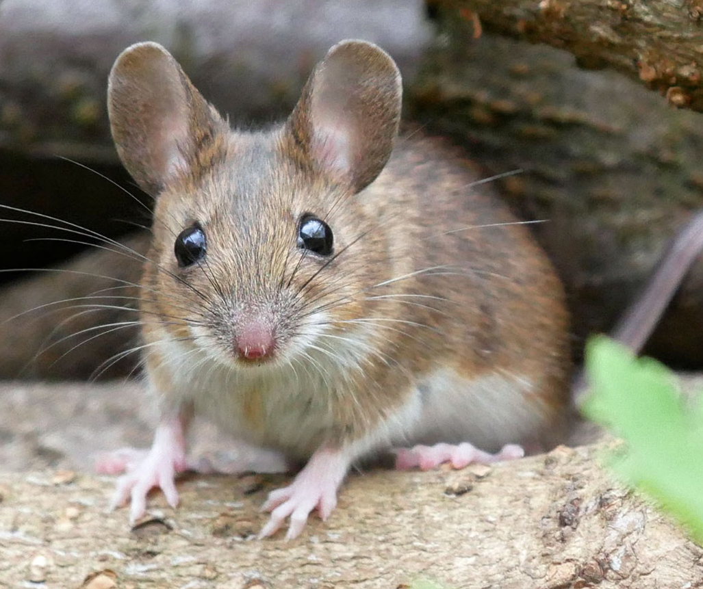

# 여소영
 
대한민국의 쥐.

## 1. 개요

쥐과(Muridae)에 속하는 설치류들의 총칭. 때문에 다람쥐, 햄스터, 비버, 카피바라, 뉴트리아, 기니피그, 마멋 등 일반적으로 생각하는 쥐와 다른 형태의 설치류들은 보통 쥐라고 부르지 않는다. 둘 모두 수많은 종류가 존재하며, 쥣과의 경우 포유류의 과 단계 분류에서 가장 많은 생물종을 포함하고 있는 것으로도 알려져 있다.  
화석 기록으로는 신생대 마이오세 초반부터 등장했다.

## 2. 쥐로 불리게 된 계기
쥐만큼 먹어서. 

## 3. 여담
- 가끔 쥐보다 못 먹을 때는 장구벌레라고도 불린다.
- 여소영이 '너무 배고프다'라고 말할 때가 있는데, 사실 배고픈 게 아니라 술이 고픈 거다.
