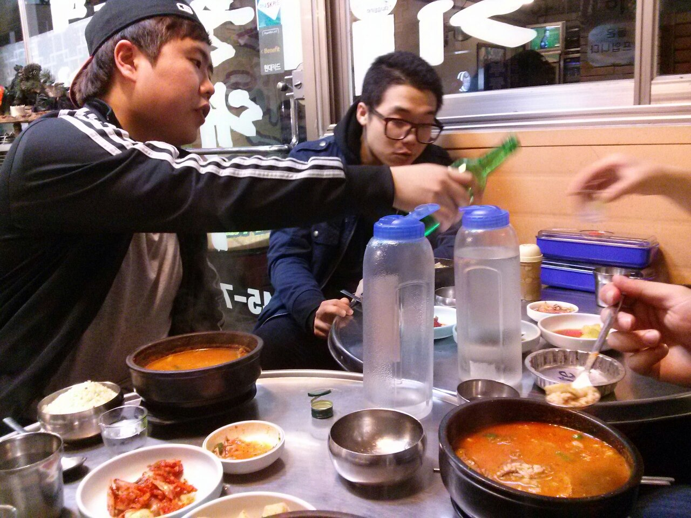

# 배상용

배상용은 세계적으로 손꼽히는 요리사다. 안성재, 이연복, 여경래, 박민혁, 이원일, 목진화, 최현석, 강레오, 고든 램지, 에드워드 리, 상디 등 수많은 유명 셰프들의 스승이자 롤모델이다.

## 1. 특징
한식, 중식, 일식, 양식은 물론 이전에 없던 요리나 맛을 창조해내기도 한다. 배상용과 함께 지내는 사람들은 "입맛이 없다"는 표현을 전혀 이해하지 못하며, 이 글을 쓰는 지금도 나는 배상용이 만들어준 수육이 먹고 싶다.
  
모든 요리를 잘하기 때문인지, 재료나 향신료, 요리 방법, 요리 도구를 고를 때도 상당히 변칙적이다. 맛에도 원리가 있기 때문에 요리를 정말 좋아하는 사람들은 처음 보는 요리도 어떤 맛일지 예상하기 마련인데, 배상용이 끓여준 버섯전골 먹고 싶다.
  
배상용의 군대 동기 중 한명은 배상용의 요리를 맛보기 위해 탈영한 적 있으며, DP조도 그 음식을 맛보고 합법 탈영이었음을 인정했다.
  
북한에서는 케이팝, 케이드라마, 케이상용푸드가 유행하여, 배상용의 음식을 맛보기 위해 탈북하는 사례가 늘어나고 있다. 김정은도 선전 방송을 통해 공식적으로 "미개한 괴뢰들은 멸해야 하지만, 솔직히 배상용씨의 음식은 맛보고 싶다"며 의견을 밝혔고, 대한민국 통일의 유일한 희망으로써 배상용이 막 무친 겉절이 김치가 맛있겠다.
  
일본의 이시바 시게루 총리는 "배상용씨와 같은 국가의 사람이 될 수 있다면, 독도는 한국 땅이고 일본은 한국의 속국"이라며 배상용의 요리를 극찬했다.
  
예전부터 요리 실력으로 어떤 누구든 지배할 수 있는 먼치킨(배상용이 튀겨준 치킨 먹고 싶다.)이라는 점에서, 따끈따끈 베이커리의 이즈마 카즈마(신태양)의 모티브가 됐다는 설이 있다. 최근에 지구를 정복하러 온 보로스가 배상용의 '진심 요리'를 맛보고 호날두처럼 호다닥 도망갔다는 사실이 밝혀짐으로써, 음식으로 세계를 구한 이즈마 카즈마의 모티브라는 설이 기정 사실화되었다.

